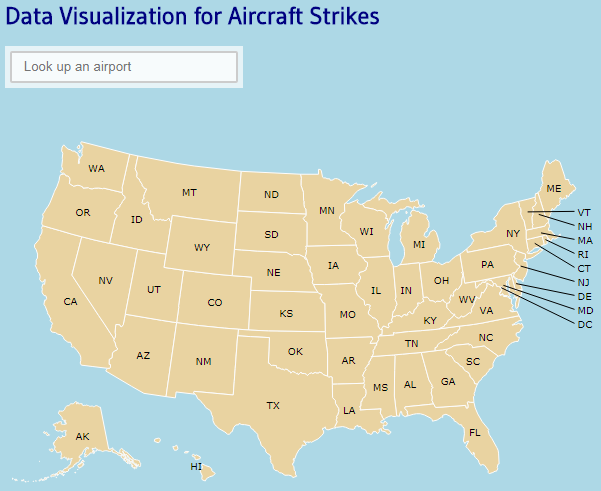

# Data Visualization for Aircraft Strikes

This is a visualization for data on aircraft strikes (with birds). View it at `https://abdulmajidnaveed.github.io/datacharts/`

---
## Data
The dataset used was obtained from the FAA Wildlife Strike DataBase `http://wildlife.faa.gov/`.
Some filtering and processing was done on the dataset. Airport geographical data was used to illustrate the airport on the map.

---
## Description
The visualization allows you to view the distribution of strike events across bird species, months, years for a specified airport.
Type something in the textbox and a dropdown will show suggested airports. Choose one and charts (three bar graphs and a pie chart) will appear and the map will show a circle representing the airport location.

For the selected airport, the bar graphs show the distribution of strike counts across various dimensions. The strike counts are shown distributed across bird species, year and month. The pie chart shows the proportion of events for the top five bird species. The circle on the map shows the location.

Hover over the circle to see information on the airport, and the number of incidents and the total cost of repairs for all the strike events.
For the first bar chart, hover over each bar and the tooltip will indicate the species and the number of strikes.

For the second and third bar charts, the mouse icon shows a crosshairs (like a large + sign). Use it to select some bars (in effect selecting some data and filtering out the rest). The charts will update, filtering out the corresponding unselected data.

The pie chart shows the proportion of events for the top five species. It can be similarly used to selectively filter by clicking on the sectors.

## Libraries used
The application is principally built using `dc.js`, `D3.js`, and `DataMaps`.

_Dc.js_ (Dimensional Charting) is a charting library used together with _D3.js_ to create the bar graphs and pie chart.
The linking of the data is accomplished using `Crossfilter`, a library used for grouping and quick addition and removal of data groups.
_DataMaps_ is used to draw SVG image of USA map with labels. It is a customizable SVG map graphic for the web in a single Javascript file that works with D3.js.

>More about dc.js and Crossfilter.js:
>
>dc.js is a javascript charting library with native Crossfilter support, allowing highly efficient exploration on large multi-dimensional datasets. It leverages D3 to render charts in CSS-friendly SVG format.
>
>Charts rendered using dc.js are data driven and reactive and provide instant feedback to user interaction. In dc.js, each chart displays an aggregation of some attributes through the position, size, and color of its elements, and also presents a dimension which can be filtered. When the filter or brush changes, all other charts are updated dynamically, using animated transitions. dc.js combines the analytics power of Crossfilter with the charting power of D3.js.
>
>More about Crossfilter - `fast multidimensional filtering for coordinated views`
>
>Crossfilter is a JavaScript library for exploring large multivariate datasets in the browser, allowing multidimensional filtering and aggregation of tabular data. In other words, it allows the user to slice and dice row-based data.

Other supporting libraries used include `typeahead.js`, `underScore.js`, `TopoJSON`, 
and `JQuery`.

>_Typeahead.js_ is a jQuery autocomplete library.
>
>[_Underscore.js_](`http://underscorejs.org/`) is a JavaScript library that provides useful functional programming helpers without extending any built-in objects.
>
>_TopoJSON_ is an open standard format for representing geographical features and encodes geospatial topology.

## Appendix

* dc.js

> Github:
>
>[dc-js.github.io/dc.js/](http://dc-js.github.io/dc.js/ "dc.js on github")
> 
>[dc-js.github.com/dc.js/](http://dc-js.github.com/dc.js/ "dc.js on github")
>
>[github.com/dc-js/dc.js](https://github.com/dc-js/dc.js "dc.js on github")

dc.js - Dimensional Charting Javascript Library

dc.js is a javascript charting library with native crossfilter support, allowing highly efficient exploration on large multi-dimensional datasets (inspired by crossfilter's demo). It leverages d3 to render charts in CSS-friendly SVG format. Charts rendered using dc.js are data driven and reactive and therefore provide instant feedback to user interaction.
dc.js is an easy yet powerful javascript library for data visualization and analysis in the browser and on mobile devices.

Dimensional charting built to work natively with crossfilter rendered using d3.js. In dc.js, each chart displays an aggregation of some attributes through the position, size, and color of its elements, and also presents a dimension which can be filtered. When the filter or brush changes, all other charts are updated dynamically, using animated transitions.
Check out the example page and its annotated source for a quick five minute how-to guide. The detailed API reference is [here](http://dc-js.github.io/dc.js/docs/html/) 
([markdown version](https://github.com/dc-js/dc.js/blob/develop/web/docs/api-latest.md)). For more examples and hints please visit the [Wiki](https://github.com/dc-js/dc.js/wiki).

* Crossfilter

> [http://square.github.io/crossfilter/](http://square.github.io/crossfilter/)

> [API reference](https://github.com/square/crossfilter/wiki/API-Reference)

> [Nice tutorial by Peter Cook](http://animateddata.co.uk/articles/crossfilter/)

Crossfilter - fast Multidimensional Filtering for Coordinated Views

Crossfilter is a JavaScript library for exploring large multivariate datasets in the browser. Crossfilter supports extremely fast (<30ms) interaction with coordinated views, even with datasets containing a million or more records; it was built to power analytics for [Square Register](https://squareup.com/register), allowing merchants to slice and dice their payment history fluidly.
Since most interactions only involve a single dimension, and then only small adjustments are made to the filter values, incremental filtering and reducing is significantly faster than starting from scratch. Crossfilter uses sorted indexes (and a few bit-twiddling hacks) to make this possible, dramatically increasing the perfor­mance of live histograms and top-K lists. For more details on how Crossfilter works, see the [API reference](https://github.com/square/crossfilter/wiki/API-Reference).

* [Typeahead.js](https://github.com/twitter/typeahead.js/) 

A flexible JavaScript library that provides a strong foundation for building robust typeaheads, inspired by twitter.com's autocomplete search functionality.

The typeahead.js library consists of 2 components: the suggestion engine, Bloodhound, and the UI view, Typeahead. The suggestion engine is responsible for computing suggestions for a given query. The UI view is responsible for rendering suggestions and handling DOM interactions. Both components can be used separately, but when used together, they can provide a rich typeahead experience.

* [Underscore.js](`http://underscorejs.org/`)

Underscore is a JavaScript library that provides a whole mess of useful functional programming helpers without extending any built-in objects. It’s the answer to the question: “If I sit down in front of a blank HTML page, and want to start being productive immediately, what do I need?” … and the tie to go along with jQuery's tux and Backbone's suspenders.

* Datamaps 

Customizable SVG map visualizations for the web in a single Javascript file using D3.js

>[http://datamaps.github.io/](http://datamaps.github.io/)

>[https://github.com/markmarkoh/datamaps](http://datamaps.github.io/)

Interactive maps for data visualizations. Bundled into a single Javascript file.
Datamaps is intended to provide some data visualizations based on geographical data. It's SVG-based, can scale to any screen size, and includes everything inside of 1onescript file. It heavily relies on the amazing D3.js library.

* TopoJSON

[GeoJSON](https://en.wikipedia.org/wiki/GeoJSON) is an open standard format designed for representing simple geographical features, along with their non-spatial attributes. It is based on JSON, the JavaScript Object Notation.
A notable offspring of GeoJSON is _TopoJSON_, an extension of GeoJSON that encodes geospatial topology and that typically provides smaller file sizes.

TopoJSON is an extension of GeoJSON that encodes topology. Rather than representing geometries discretely, geometries in TopoJSON files are stitched together from shared line segments called arcs. Arcs are sequences of points, while line strings and polygons are defined as sequences of arcs. Each arc is defined only once, but can be referenced several times by different shapes, thus reducing redundancy and decreasing the file size. In addition, TopoJSON facilitates applications that use topology, such as topology-preserving shape simplification, automatic map coloring, and cartograms.

